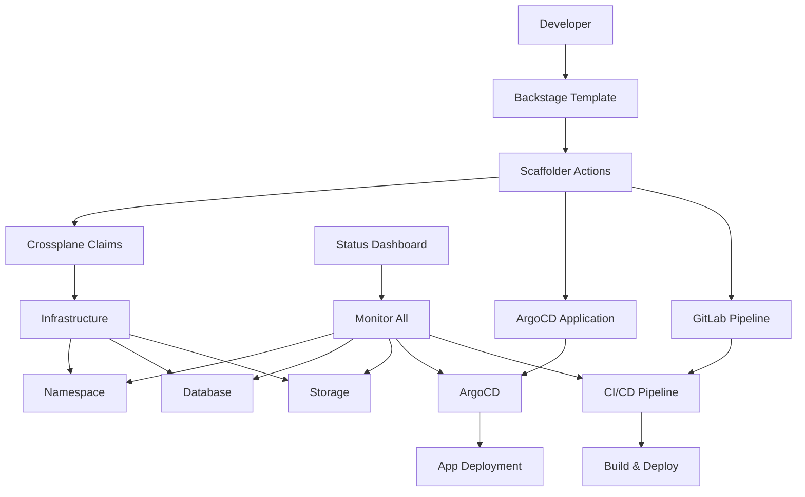

# 🚀 Backstage + Crossplane Environment Workflow Implementation

## 🎯 **Complete Workflow Overview**

This implementation provides a complete **"Create Environment"** workflow in Backstage that provisions infrastructure using Crossplane and deploys applications via ArgoCD.

### **Workflow Steps:**
1. **Dev opens template** → Backstage "Create Environment" template
2. **Selects options** → Environment name, database, storage, CI choice
3. **Backstage executes** → Scaffolder actions apply Crossplane Claims
4. **Infrastructure provisioned** → Namespace, Database, Storage via Crossplane
5. **ArgoCD detects** → Automatically deploys to provisioned namespace
6. **Status monitoring** → Real-time environment health in Backstage

---

## 📁 **What Was Created**

### **1. Backstage Template** 
📍 `backstage_catalog/templates/create-environment/`
- **template.yaml** - Main template with form inputs
- **skeleton/** - Template files for environment creation
  - `catalog-info.yaml` - Backstage catalog registration
  - `namespace.yaml` - Kubernetes namespace
  - `database-claim.yaml` - Crossplane database provisioning
  - `storage-claim.yaml` - Crossplane storage provisioning
  - `argocd-application.yaml` - ArgoCD application setup
  - `.gitlab-ci-environment.yml` - GitLab CI pipeline for environments

### **2. Crossplane Compositions**
📍 `backstage_catalog/crossplane/`
- **database-compositions.yaml** - PostgreSQL & MySQL database provisioning
- **storage-compositions.yaml** - PVC and StorageClass management

### **3. ArgoCD Integration**
📍 `backstage_catalog/argocd/`
- **applicationset-environments.yaml** - Dynamic environment detection & deployment

### **4. Status Dashboard**
📍 `backstage_catalog/environment-dashboard.yaml`
- Environment monitoring API definition
- Status tracking for namespace, database, storage, ArgoCD, CI/CD

---

## 🔧 **Implementation Requirements**

### **What You Need to Set Up:**

### **1. Backstage Plugins & Configuration**
Add to your Backstage instance:

```yaml
# app-config.yaml additions
catalog:
  locations:
    - type: file
      target: ./backstage_catalog/templates/create-environment/template.yaml
    - type: file  
      target: ./backstage_catalog/environment-dashboard.yaml

integrations:
  gitlab:
    - host: gitlab.com
      token: ${GITLAB_TOKEN}

kubernetes:
  serviceLocatorMethod:
    type: 'multiTenant'
  clusterLocatorMethods:
    - type: 'config'
      clusters:
        - url: https://kubernetes.default.svc
          name: local-cluster
          authProvider: 'serviceAccount'

argocd:
  baseUrl: https://argocd.your-domain.com
  username: admin
  password: ${ARGOCD_PASSWORD}
```

### **2. Required Backstage Plugins**
Install these plugins in your Backstage:
```bash
# In packages/app/package.json
@backstage/plugin-kubernetes
@backstage/plugin-argocd
@roadiehq/backstage-plugin-argo-cd
@backstage/plugin-scaffolder-backend-module-gitlab
```

### **3. Crossplane Setup**
Install Crossplane in your cluster:
```bash
# Install Crossplane
helm repo add crossplane-stable https://charts.crossplane.io/stable
helm install crossplane crossplane-stable/crossplane --namespace crossplane-system --create-namespace

# Apply the compositions
kubectl apply -f backstage_catalog/crossplane/database-compositions.yaml
kubectl apply -f backstage_catalog/crossplane/storage-compositions.yaml

# Install providers (example for AWS)
kubectl apply -f - <<EOF
apiVersion: pkg.crossplane.io/v1
kind: Provider
metadata:
  name: provider-aws
spec:
  package: xpkg.upbound.io/crossplane-contrib/provider-aws:v0.44.0
EOF
```

### **4. ArgoCD Setup**
Apply the ApplicationSet:
```bash
kubectl apply -f backstage_catalog/argocd/applicationset-environments.yaml
```

### **5. GitLab CI Variables**
Add these to your GitLab project variables:
- `KUBE_CONFIG` - Base64 encoded kubeconfig
- `GITLAB_TOKEN` - GitLab API token for Backstage
- `ARGOCD_PASSWORD` - ArgoCD admin password

---

## 🎮 **How to Use**

### **For Developers:**
1. **Open Backstage** → Navigate to "Create" → "Create Environment"
2. **Fill the form:**
   - Environment Name: `my-dev-env`
   - Database: Yes, PostgreSQL, 10Gi
   - Storage: 5Gi, standard
   - CI: GitLab CI/CD
   - Repository: Your app repo URL
3. **Click "Create"** → Backstage provisions everything
4. **Monitor progress** → Check the environment dashboard

### **What Gets Created:**
- ✅ Kubernetes namespace: `my-dev-env`
- ✅ PostgreSQL database (via Crossplane)
- ✅ Persistent storage (5Gi)
- ✅ ArgoCD application
- ✅ GitLab CI pipeline triggered
- ✅ Backstage catalog entries

### **Monitoring & Management:**
- **Backstage Dashboard** → See all environment status
- **ArgoCD UI** → Monitor deployments
- **Kubernetes** → Check resources in namespace
- **GitLab CI** → Track pipeline status

---

## 🔄 **Architecture Flow**



---

## 🎯 **Next Steps**

1. **Deploy to your Backstage instance** - Apply all the created files
2. **Configure Crossplane providers** - Set up your cloud provider credentials
3. **Test the workflow** - Create a test environment via the template
4. **Customize as needed** - Adjust forms, compositions, or pipeline steps
5. **Add more providers** - Extend with MongoDB, Redis, etc.

This implementation gives you a complete **Infrastructure as Code + GitOps** workflow managed through Backstage! 🚀